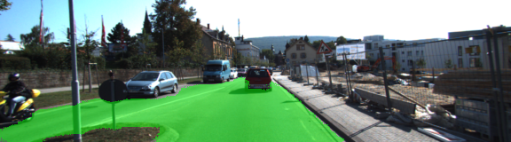
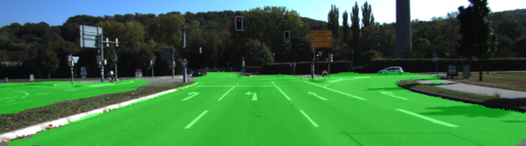
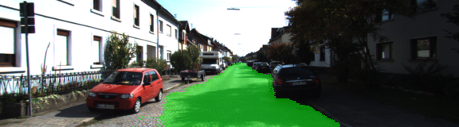

# Semantic Segmentation
### Introduction
The goal of this project is to label the pixels of a road in images using a Fully Convolutional Network (FCN).

### Architecture 
This project use VGG-16 image classifier architecture for performing semantic segmentation (trained and tested on the KITTI data set) as described in the [Fully Convolutional Networks for Semantic Segmentation](./References/long_shelhamer_fcn.pdf) by Jonathan Long, Even Shelhamer, and Trevor Darrel.

### Optimizer
The loss function for the network is cross-entropy, and an Adam optimizer is used.

### Training
The hyperparameters used for training are:

keep_prob: 0.8

learning_rate: 1e-4

epochs: 20

batch_size: 8

### Result
Below are a few sample images from the output of the fully convolutional network, with the segmentation class overlaid upon the original image in green.

### Setup
##### GPU
`main.py` will check to make sure you are using GPU - if you don't have a GPU on your system, you can use AWS or another cloud computing platform.
##### Frameworks and Packages
Make sure you have the following is installed:
 - [Python 3](https://www.python.org/)
 - [TensorFlow](https://www.tensorflow.org/)
 - [NumPy](http://www.numpy.org/)
 - [SciPy](https://www.scipy.org/)
##### Dataset
Download the [Kitti Road dataset](http://www.cvlibs.net/datasets/kitti/eval_road.php) from [here](http://www.cvlibs.net/download.php?file=data_road.zip).  Extract the dataset in the `data` folder.  This will create the folder `data_road` with all the training a test images.

### Tips
- The link for the frozen `VGG16` model is hardcoded into `helper.py`.  The model can be found [here](https://s3-us-west-1.amazonaws.com/udacity-selfdrivingcar/vgg.zip).
- The model is not vanilla `VGG16`, but a fully convolutional version, which already contains the 1x1 convolutions to replace the fully connected layers. Please see this [post](https://s3-us-west-1.amazonaws.com/udacity-selfdrivingcar/forum_archive/Semantic_Segmentation_advice.pdf) for more information.  A summary of additional points, follow. 
- The original FCN-8s was trained in stages. The authors later uploaded a version that was trained all at once to their GitHub repo.  The version in the GitHub repo has one important difference: The outputs of pooling layers 3 and 4 are scaled before they are fed into the 1x1 convolutions.  As a result, some students have found that the model learns much better with the scaling layers included. The model may not converge substantially faster, but may reach a higher IoU and accuracy. 
- When adding l2-regularization, setting a regularizer in the arguments of the `tf.layers` is not enough. Regularization loss terms must be manually added to your loss function. otherwise regularization is not implemented.

